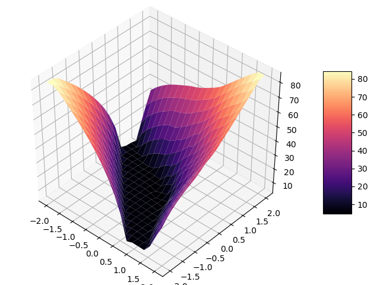

# Yama 山

Visualize loss surface in 3D.

  
  
  

## References

- [Hao Li et.al. "Visualizing the Loss Landscape of Neural Nets"](https://arxiv.org/abs/1712.09913)
- [Original code in Python](https://github.com/tomgoldstein/loss-landscape)
